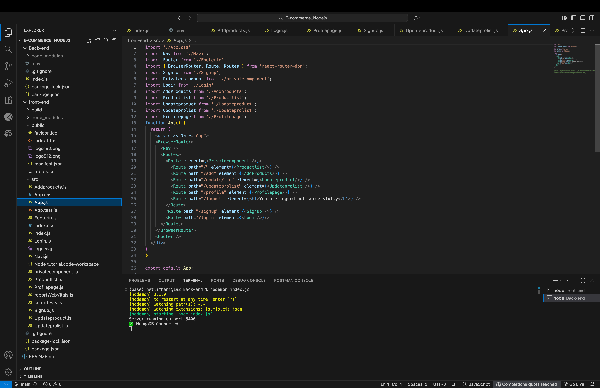
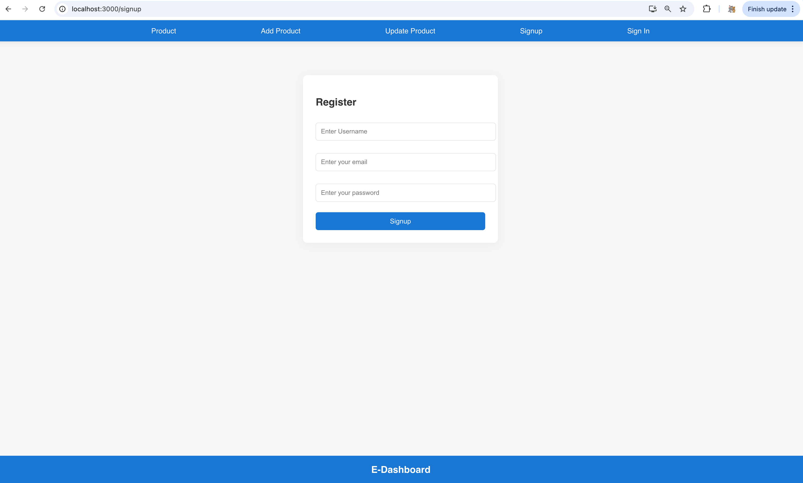
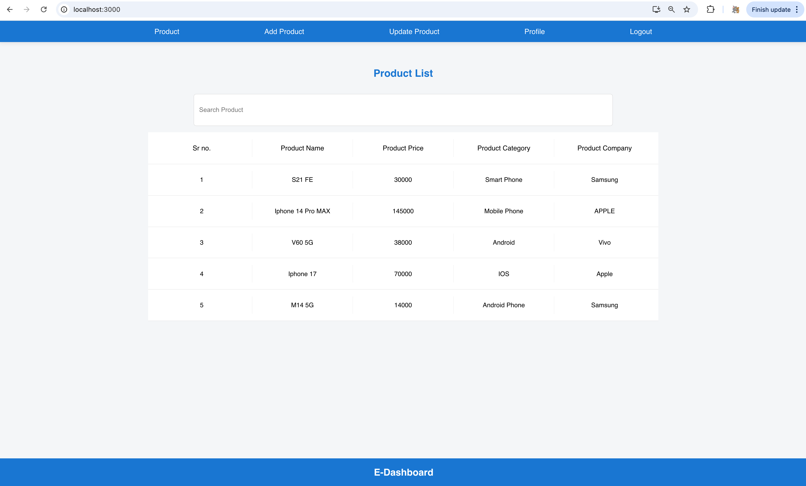
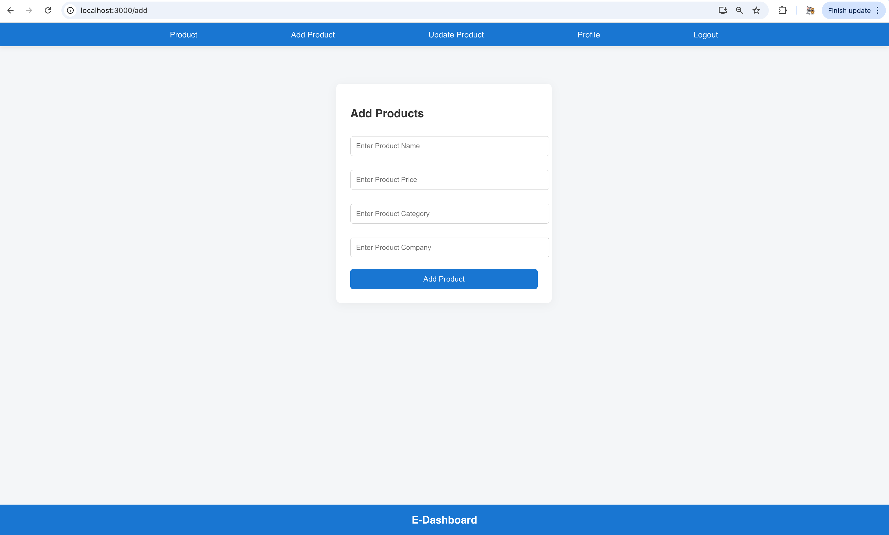
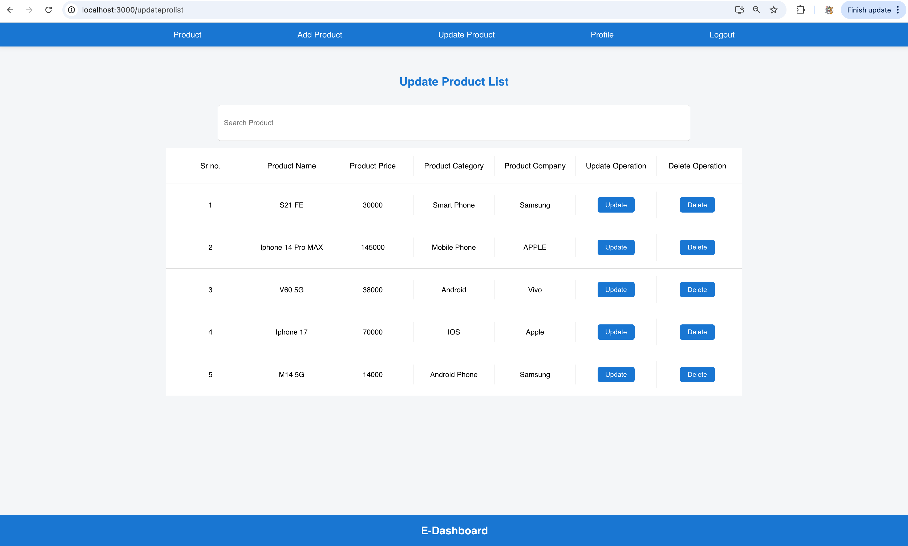
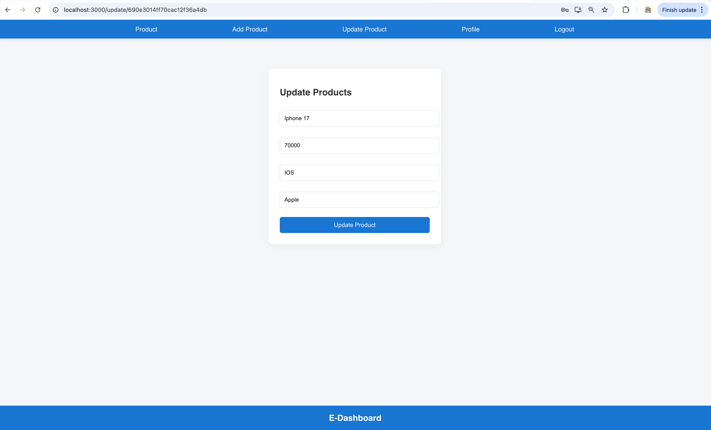
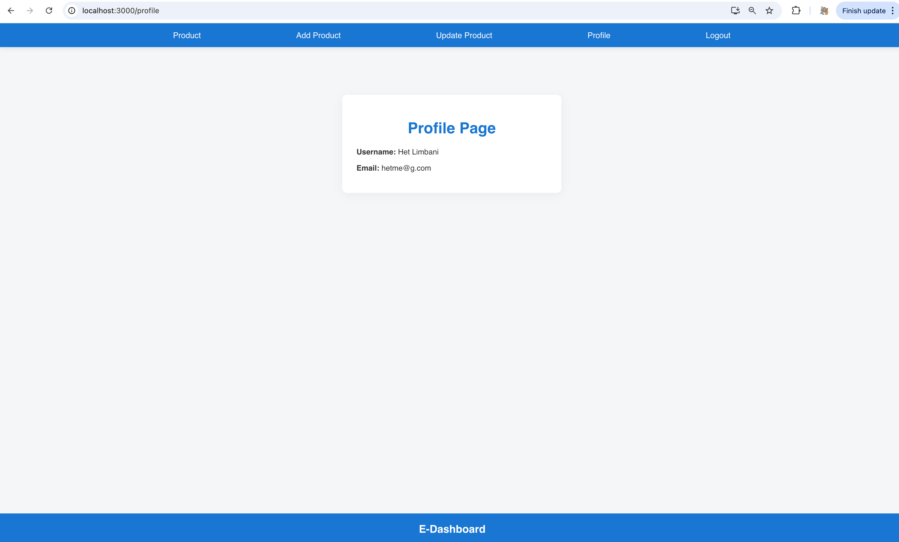
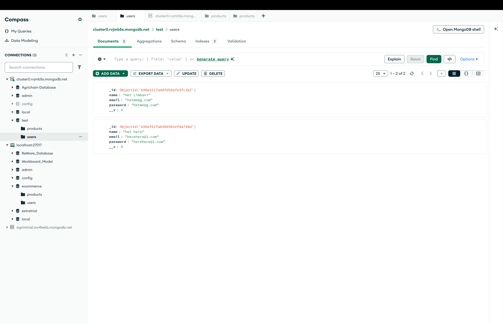

# E-commerce_Nodejs
A basic E-commerce website built using React, Node.js, CSS, and MongoDB for backend data storage.

## Features
- User authentication (Signup/Login)
- Product management (Add/Update/Delete)
- Profile management
- Protected routes
- Dynamic product listing
- User-friendly navigation

## Tech Stack
- Frontend: React.js, CSS3
- Backend: Node.js, Express.js
- Database: MongoDB
- Authentication: JWT (JSON Web Tokens)

## Project Structure
```
E-commerce_Nodejs/
├── Back-end/           # Node.js server code
│   ├── index.js        # Server entry point
│   └── package.json    # Backend dependencies
└── front-end/          # React application
    ├── public/         # Static files
    └── src/            # Source code
        ├── Pages       # React pages (Addproducts.js, Productlist.js etc..)
        └── App.css     # CSS styles
```

# Getting Started with Create React App

This project was bootstrapped with [Create React App](https://github.com/facebook/create-react-app).

## Available Scripts

In the project directory, you can run:

### `npm start`

Runs the app in the development mode.\
Open [http://localhost:3000](http://localhost:3000) to view it in your browser.
The page will reload when you make changes.\
You may also see any lint errors in the console.


### It is my project code screenshot..


### It is my project frontend screen shot


### It is my project Demo video on Linkdln
https://www.linkedin.com/posts/het-limbani-a62a8131a_reactjs-nodejs-css-activity-7319622045506433025-qSA9?utm_source=share&utm_medium=member_desktop&rcm=ACoAAFD17KoBKwdo2fmF7tvqRxEAvFSK-rpekWA

## Backend startup

Follow these steps to run the backend server locally. The backend code lives in the `Back-end/` folder and requires a MongoDB connection string set in an environment file.

1. Create a `.env` file inside the `Back-end/` folder with at least the MongoDB URI:

```
MONGO_URI=your_mongodb_connection_string_here
PORT=5400    # optional, defaults to 5400 if not provided
```

2. Install dependencies and start the server:

```bash
cd Back-end
npm install
# The package.json currently references `server.js` in the start script; this repo's backend entry is `index.js`.
# You can start the app directly with:
node index.js
# Or update `Back-end/package.json` to set the start script to `node index.js` and then run:
# npm start
```

3. Open the API in your browser or use curl/Postman:

```
http://localhost:5400/
```

Notes:
- The server expects `process.env.MONGO_URI` to be set. If you use a hosted MongoDB (Atlas), paste the connection string into the `.env` file.
- The code uses a hard-coded JWT key variable `Jwtkey = 'ecomm'` in `Back-end/index.js`. For production, move this into your `.env` and read it via `process.env.JWT_KEY` instead.

## Screenshots (place images in `assets/images/` or use URLs)

Below is a sample table layout for the 8 screenshots you mentioned. Order (left→right, top→bottom):
- 1: Code screenshot
- 2–7: Frontend screenshots (six images)
- 8: Data storage / database screenshot

| Code (1) | Frontend (1) | Frontend (2) | Frontend (3) |
|---|---|---|---|
|  |  |  |  |

| Frontend (4) | Frontend (5) | Frontend (6) | Data storage (8) |
|---|---|---|---|
|  |  |  |  |


